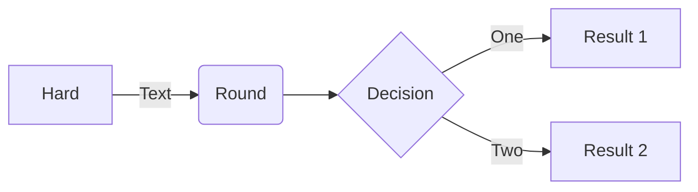

### Ngôn ngữ lập trình

### Frameworks và Thư viện

### Công cụ & IDE

### Hệ điều hành

## 02. Table of Some Useful Tools & Technology Stacks

| Alibaba | Ali-Cloud | AlpineJS | Audition | Axios | Bootstrap |
| --- | --- | --- | --- | --- | --- |
|  |  |  |  |  |  |

| C | ChatGPT | C++ | C# | CSS | Docker |
| --- | --- | --- | --- | --- | --- |
|  |  |  |  |  |  |

| Git | GitHub | Java | JavaScript | Node.js | Python |
| --- | --- | --- | --- | --- | --- |
|  |  |  |  |  |  |

<!-- Đây là chú thích và không liên quan tới Mermaid -->
<!--**thanhtrung-le/thanhtrung-le** is a ✨ _special_ ✨ repository because its `README.md` (this file) appears on your GitHub profile.>

<!--Here are some ideas to get you started:>

- 🔭 I’m currently finding a position on industry
- 🌱 I’m currently learning in Ho Chi Minh University of Technology
<!-- 👯 I’m looking to collaborate on ...
    - 🤔 I’m looking for help with ...
    - 💬 Ask me about ...
    - 📫 How to reach me: ...
    - 😄 Pronouns: ...
    - ⚡ Fun fact: ...
-->

